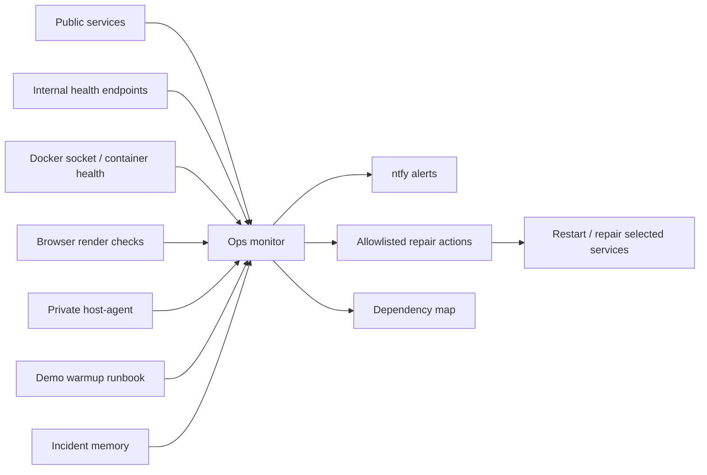
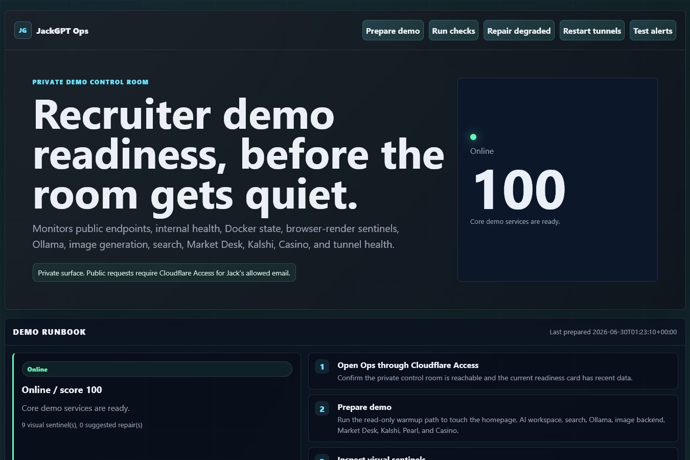
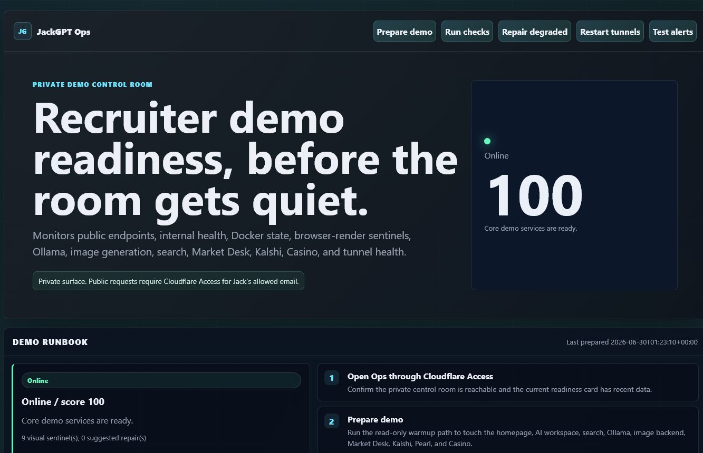
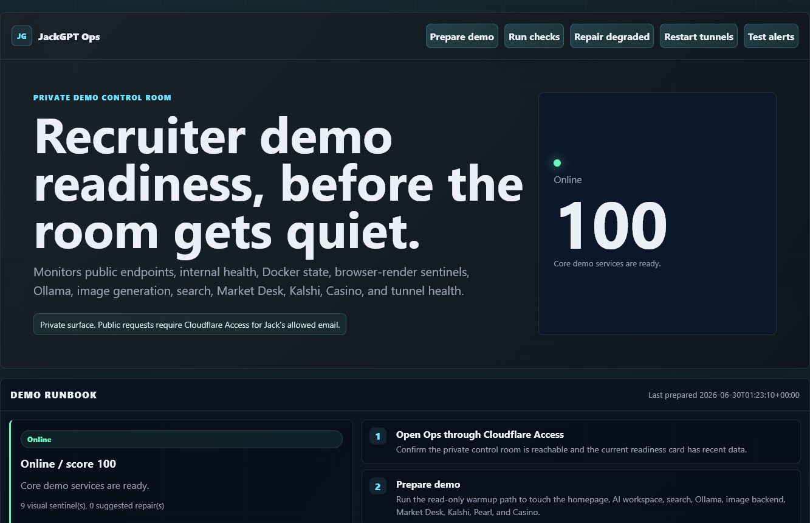

# JackGPT Ops Control Room

JackGPT Ops Control Room is the private reliability layer behind the JackGPT portfolio. It is designed to make live recruiter demos less fragile by monitoring the ecosystem, alerting on repeated failures, and repairing predictable degraded states without exposing private infrastructure controls.

The live control room is private at `ops.jackgpt.org` behind Cloudflare Access. This public note explains the architecture at a recruiter-safe level only.

## What It Monitors

- Public endpoints such as the homepage, AI workspace, Image Gen, Search, Market Desk, Kalshi Climate Desk, Casino, Pearl Desk, Moomoo, Salad, Mesh, and Minecraft status.
- Internal health endpoints on Docker services.
- Docker container state and healthcheck results.
- Browser-render checks for blank pages, broken UI, framework overlays, and console errors.
- Ollama/model-host availability, image-generation backend health, Search result health, Cloudflare tunnel health, and selected host-agent signals.
- Demo-prep warmups for the recruiter path: homepage, AI Workspace, Ollama, Search, Image Gen, Market Desk, Kalshi, Pearl, and Casino.
- Dependency rollups for public routes, internal services, host agents, tunnels, alert channels, and GPU-idle guard state.

## How It Works

The monitor runs inside Docker as a FastAPI service. It keeps a readiness score, current service table, browser screenshot history, alert history, repair history, demo-prep history, dependency map, and incident memory. A separate private host-agent exposes narrowly scoped repair actions for things that live outside Docker, such as Windows-hosted bot processes or compute services.

## Demo Runbook

Ops includes a read-only `Prepare demo` path. It warms the public and internal routes that are most likely to be used in a recruiter walkthrough, refreshes browser-render sentinels, and returns a short recommended repair queue when a dependency is degraded.

The warmup path intentionally avoids hidden broad restarts. It checks and primes the services, then leaves repair decisions to the explicit allowlisted repair system. This keeps the control room useful before a demo without making surprising state changes.

## Dependency Map

The dependency map groups service health by operational layer:

- Cloudflare tunnels and public routing.
- Homepage, AI Workspace, Search, Image Gen, Market Desk, Kalshi, Pearl, and support demos.
- Ollama/model host, SearXNG/Valkey, image backend, and GPU-idle guard.
- Private host-agent bridge and alert channels.

This makes a failed demo easier to reason about: a public route failure, a container failure, an AI dependency failure, and a host-agent failure are different problems with different recovery paths.

## Incident Memory

Ops keeps a public-safe list of known failure classes and their recovery protocols. Current examples include Search degradation from unreliable upstream engines, image-generation slowness from GPU contention, Docker Desktop/WSL abrupt termination, Market Desk public-data fallback issues, Kalshi scanner heartbeat problems, and Ollama model slowness.

The goal is not just to restart services. The goal is to stop rediscovering the same root causes under demo pressure.

## Repair Model

Repairs are intentionally conservative:

- Only allowlisted targets can be repaired.
- Offline and degraded states require configured thresholds before automatic repair runs.
- Cooldowns prevent restart loops and alert spam.
- Public-facing repair messages are scrubbed of secrets, paths, logs, and strategy details.
- Some repairs call a host-agent path, while others restart Docker containers directly.

Examples of predictable repairs:

- Search: enforce stable SearXNG defaults and restart/validate the service.
- AI Workspace: restart OpenWebUI and Ollama.
- Image Gen: restart the lightweight frontend, backend, and tunnel.
- Market Desk, Casino, Pearl Desk, Temp, Moomoo, and Salad: restart or validate the relevant container or host-agent bridge.
- Tunnels: restart Cloudflare tunnel containers when public routing fails.

## Security Boundaries

The private Ops UI is not intended as a public demo. It can trigger service restarts and host-side repair actions, so the live route is gated by Cloudflare Access. Public materials should only show sanitized screenshots and architecture notes.

Not public:

- Secrets, tokens, SMTP credentials, tunnel credentials, or ntfy topic.
- Private host paths, local logs, order IDs, account identifiers, API keys, or private strategy internals.
- Full host-agent source with live operational commands.

Public-safe:

- High-level architecture.
- Screenshots that show readiness, health, and repair concepts without credentials.
- Design and implementation notes explaining monitoring, alerts, throttled repair, and demo-readiness thinking.

## Screenshots

## Recruiter Takeaway

Ops Control Room shows that JackGPT is not just a set of demos. It is an operated ecosystem with monitoring, alerting, visual QA, dependency checks, health endpoints, private administrative controls, and recovery paths for predictable failures.
